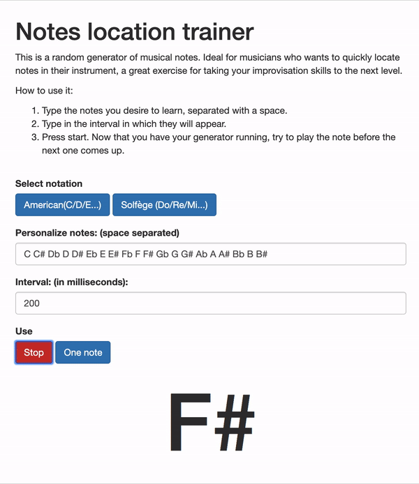

# Notes location trainer
This is a random generator of musical notes. Ideal for musicians who wants to quickly locate notes in their instrument, a great exercise for taking your improvisation skills to the next level.

## How to use it
0. Download ZIP and open `index.html`.
1. Type the notes you desire to learn, separated with a space.
2. Type in the interval in which they will appear.
3. Press start. Now that you have your generator running, try to play the note before the next one comes up.

## Screenshot

